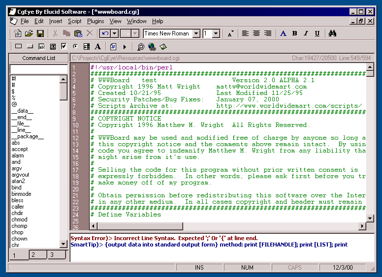



## CgEye 1\.0 Beta 1 \(Previous Award Winner\)

### Description

The previous Award winning CgEye has now taken a a few steps up in the world of its own. Planned to be released as a commerical application but decided to go ahead and release its source code instead. Has had MANY MANY additional features added to it since its last post. To many to list so just check them out yourself =]  We are proud to announce as well that Elucid Software is a 4 time award winner now!!!
 
### More Info
 

             |
---                |---
**Submitted On**   |2000-12-24 22:55:08
**By**             |[Eric Malamisura](https://github.com/Planet-Source-Code/PSCIndex/blob/master/ByAuthor/eric-malamisura.md)
**Level**          |Advanced
**User Rating**    |4.0 (20 globes from 5 users)
**Compatibility**  |VB 4\.0 \(32\-bit\), VB 5\.0, VB 6\.0
**Category**       |[Complete Applications](https://github.com/Planet-Source-Code/PSCIndex/blob/master/ByCategory/complete-applications__1-27.md)
**World**          |[Visual Basic](https://github.com/Planet-Source-Code/PSCIndex/blob/master/ByWorld/visual-basic.md)
**Archive File**   |[CODE\_UPLOAD13341132001\.zip](https://github.com/Planet-Source-Code/eric-malamisura-cgeye-1-0-beta-1-previous-award-winner__1-14097/archive/master.zip)

